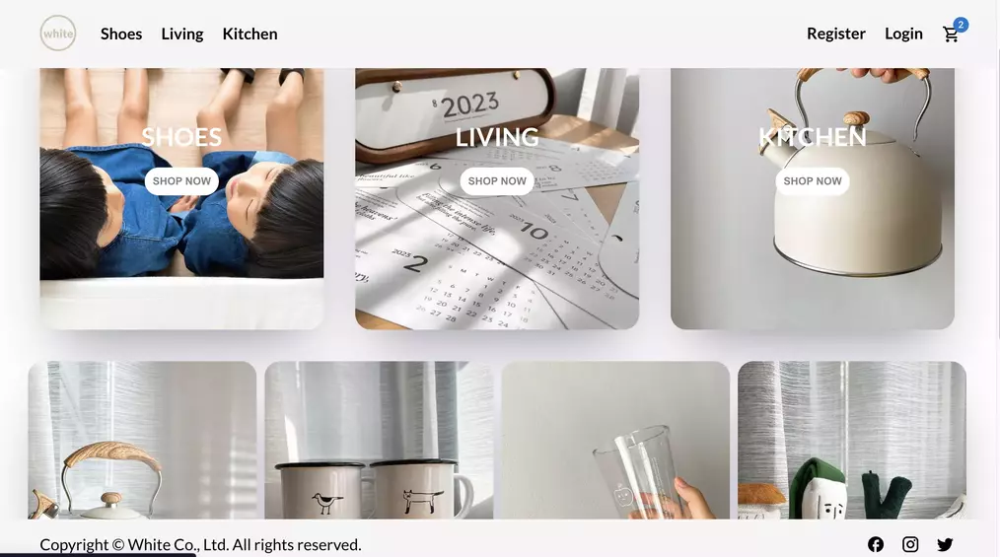

# It's all white

## Summary

Discover trending and fancy living accessories in it's all white online shop!

[Live Demo](https://allwhite.netlify.app/)



[Front end codes](https://github.com/christy313/white-front-end)

## Stacks

Front-end: React / Redux Toolkit / React Router / styled-component \
Back-end: Node / Express / MongoDB / JWT / Stripe

## Installation

### Clone the project

```
$ git clone git@github.com:christy313/white-back-end.git
$ cd white-back-end
```

### Install packages

`$ npm install`

### Set up environment variables in .env file

```
MONGO_URL=

PORT=

JWT_SECRET=

STRIPE_KEY=

BASE_URL=
```

### Start the server

`$ npm start`

## Future Improvement

- order list for each user

## File structure

```
.
├── README.md
├── index.js
├── models
│   ├── Cart.js
│   ├── Order.js
│   ├── Product.js
│   └── User.js
├── package-lock.json
├── package.json
├── public
│   └── white.webp
└── routes
    ├── auth.js
    ├── cart.js
    ├── order.js
    ├── product.js
    ├── stripe.js
    ├── user.js
    └── verifyToken.js
```